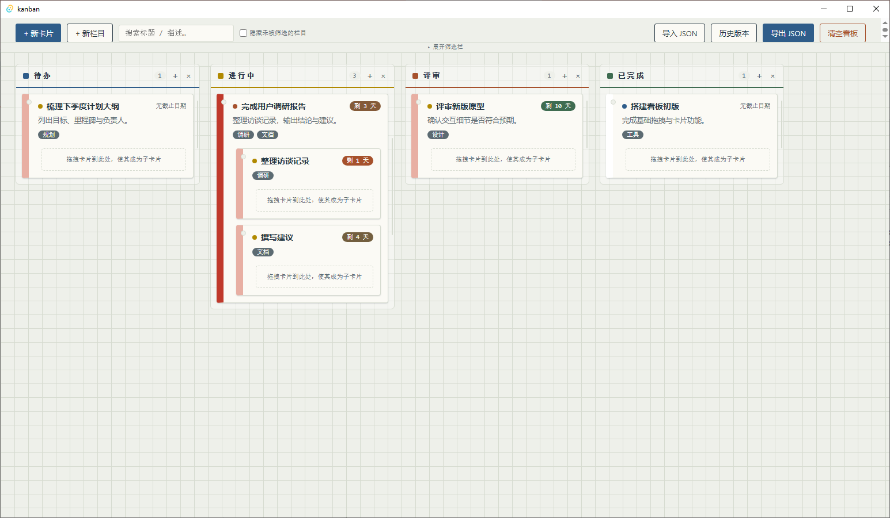

# Kanban 看板工作台

An offline-first kanban board built with **Tauri 2** and **vanilla HTML/CSS/JS**. No backend, no cloud — your data stays local.



> **Prebuilt versions:** download installers and portable binaries from [GitHub Releases](../../releases).

> 中文简介见下方：[中文说明](#中文说明)

## Features

- **Columns**: add, rename, delete, reorder by drag-and-drop, and resize by dragging the column edge
- **Cards**: title, description, priority (low / medium / high), due date, and tags; create, edit, and delete
- **Nested subtasks**: drag a card onto another card to make it a child; moving a parent moves its whole subtree
- **Search & filters**: text search, tag filtering, due-date buckets, hide empty columns, and a collapsible filter bar
- **Drag & drop**: reorder cards within/between columns, drop into subtask areas, and reorder columns
- **Auto-save & dirty indicator**: changes are auto-saved after a short pause, with an unsaved-changes indicator
- **History**: keeps up to 50 timestamped snapshots; restore any version from the history modal
- **Import / Export JSON**: uses native file dialogs, with a fallback to the app storage directory
- **Zoom**: Ctrl/Cmd + scroll or `+` / `-` / `0` keys (50% – 200%)
- **Window state**: remembers size, position, and maximized state across launches
- **Offline-first**: fully local, no network required

## Tech Stack

- [Tauri 2](https://tauri.app/) desktop shell
- Vanilla HTML/CSS/JavaScript (no frontend framework)
- Rust backend commands for file persistence
- [`@tauri-apps/plugin-dialog`](https://tauri.app/plugin/dialog/) for native open/save dialogs
- GitHub Actions release workflow for Windows and Linux

## Getting Started

### Prerequisites

- [Node.js](https://nodejs.org/) LTS
- [Rust](https://www.rust-lang.org/) stable
- Tauri v2 platform dependencies — see the [Tauri prerequisites](https://v2.tauri.app/start/prerequisites/)

### Install & Run

```bash
npm install
npm run tauri dev
```

### Build

```bash
npm run tauri build
```

### Release via GitHub Actions

Push a version tag to trigger the cross-platform release workflow:

```bash
git tag v1.0.0
git push origin v1.0.0
```

The workflow builds Windows and Linux bundles and creates a GitHub Release. Prebuilt versions can be downloaded from the **Assets** section of each release.

- **Windows**: NSIS installer (`.exe` setup), MSI installer (`.msi`), and a portable `.exe`
- **Linux**: `.deb`, `.rpm`, and `.AppImage`

> The portable Windows `.exe` is the raw Tauri binary. It does not require installation, but it does require the [WebView2 runtime](https://developer.microsoft.com/microsoft-edge/webview2/) (usually preinstalled on Windows 10/11).

## Data Storage

All data is stored locally in a `kanban-data` folder next to the executable:

```
<executable directory>/
└── kanban-data/
    ├── latest.json               # current board state
    └── history/
        ├── index.json            # snapshot metadata (up to 50 entries)
        └── state_<timestamp>.json # individual history snapshots
```

- Every auto-save writes a new timestamped snapshot and updates `latest.json`.
- Use **历史版本 / History** in the app to restore an older snapshot.
- Use **导出 JSON / Export** to back up or move your board.

## Project Structure

```
.
├── .github/workflows/release.yaml   # GitHub Actions cross-platform release
├── src/
│   └── index.html                   # frontend: styles, markup, and app logic
├── src-tauri/
│   ├── src/
│   │   ├── main.rs                  # Tauri entry point
│   │   └── lib.rs                   # Rust commands: persistence, history, file I/O
│   ├── Cargo.toml
│   └── tauri.conf.json
└── package.json
```

## 中文说明

**看板工作台** 是一个基于 Tauri 2 + 原生 HTML/CSS/JS 的离线看板应用。所有数据都保存在本地，无需联网或后端服务。

主要功能：

- 多栏目看板：新建、重命名、删除、拖拽排序、拖动调整栏宽
- 卡片支持标题、描述、优先级、截止日期、标签
- 子卡片：把卡片拖到另一张卡片上即可成为其子卡片，父卡片移动时子卡片跟随
- 搜索、标签筛选、剩余时间筛选、隐藏空栏目
- 自动保存，并保留最多 50 份历史快照，可随时恢复
- JSON 导入/导出（使用系统文件对话框）
- Ctrl/Cmd + 滚轮或 `+` / `-` / `0` 缩放界面
- 记住窗口大小、位置与最大化状态

### 快速开始

```bash
npm install
npm run tauri dev
```

打包：

```bash
npm run tauri build
```

### 下载预构建版本

预编译版本可在 [GitHub Releases](../../releases) 的 **Assets** 中下载。Windows 提供安装包与便携 `.exe`，Linux 提供 `.deb`、`.rpm` 和 `.AppImage`。

> 便携版 `.exe` 是未打包的原始 Tauri 程序，无需安装即可运行，但需要系统已安装 [WebView2 运行时](https://developer.microsoft.com/microsoft-edge/webview2/)（Windows 10/11 通常已自带）。

### 数据位置

数据保存在可执行文件同级的 `kanban-data` 目录中：

```
kanban-data/
  latest.json          # 当前看板
  history/
    index.json         # 历史索引（最多 50 条）
    state_*.json       # 历史快照
```

移动应用时，请一并复制 `kanban-data` 文件夹即可保留数据。

## License

Released under the [MIT License](./LICENSE).

Copyright (c) 2026 Henning742

Permission is hereby granted, free of charge, to any person obtaining a copy of this software and associated documentation files (the "Software"), to deal in the Software without restriction, including without limitation the rights to use, copy, modify, merge, publish, distribute, sublicense, and/or sell copies of the Software, and to permit persons to whom the Software is furnished to do so, subject to the following conditions:

The above copyright notice and this permission notice shall be included in all copies or substantial portions of the Software.

THE SOFTWARE IS PROVIDED "AS IS", WITHOUT WARRANTY OF ANY KIND, EXPRESS OR IMPLIED, INCLUDING BUT NOT LIMITED TO THE WARRANTIES OF MERCHANTABILITY, FITNESS FOR A PARTICULAR PURPOSE AND NONINFRINGEMENT. IN NO EVENT SHALL THE AUTHORS OR COPYRIGHT HOLDERS BE LIABLE FOR ANY CLAIM, DAMAGES OR OTHER LIABILITY, WHETHER IN AN ACTION OF CONTRACT, TORT OR OTHERWISE, ARISING FROM, OUT OF OR IN CONNECTION WITH THE SOFTWARE OR THE USE OR OTHER DEALINGS IN THE SOFTWARE.
